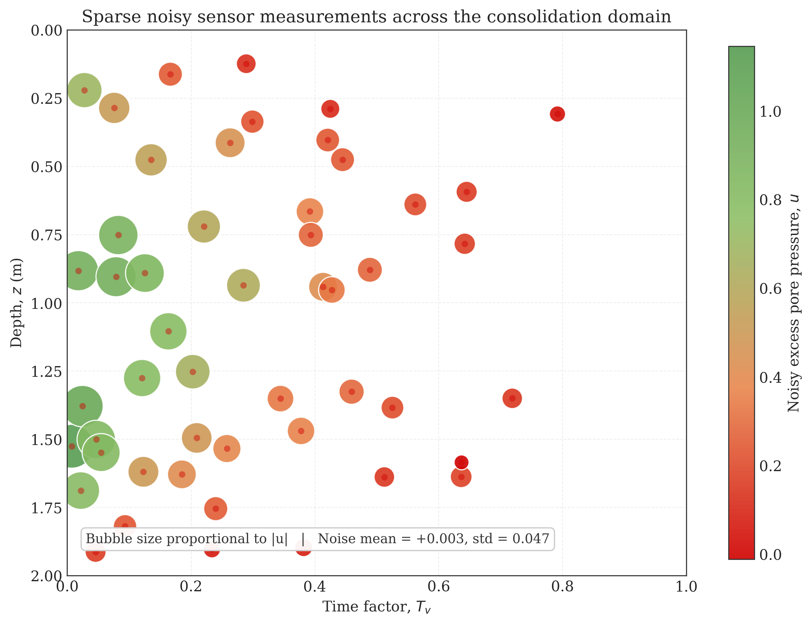
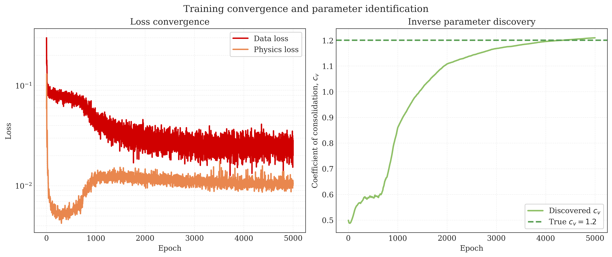
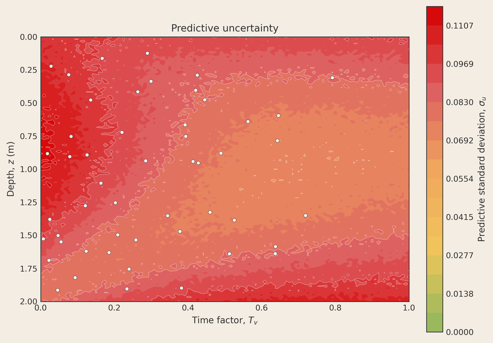
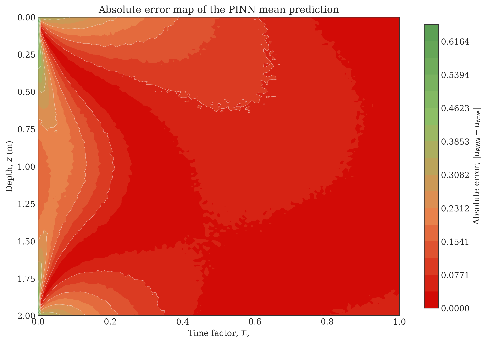

# Uncertainty-Aware Physics-Informed Neural Networks for Inverse Parameter Discovery in 1D Consolidation

**Conference:** APMCE 2026  
**Manuscript Type:** Full Paper  
**Author Block:** To be completed by the submitting team

**Keywords:** physics-informed neural network, inverse consolidation, uncertainty quantification, Monte Carlo dropout, GeoAI, digital twin, geotechnical monitoring

## Abstract

Reliable estimation of the coefficient of consolidation is central to settlement prediction, pore-pressure dissipation analysis, and staged construction planning in soft ground engineering. In conventional practice, this parameter is commonly inferred from laboratory oedometer testing and back-analysis, which are expensive, time-consuming, and difficult to scale for rapidly developing infrastructure corridors. This paper presents an uncertainty-aware physics-informed neural network (PINN) that bypasses exhaustive reliance on traditional oedometer-only workflows by inferring the consolidation coefficient directly from sparse, noisy spatiotemporal sensor data. The framework embeds Terzaghi's one-dimensional consolidation equation into the loss function and augments inverse parameter discovery with Monte Carlo dropout so that the model returns both a best estimate and confidence bounds. In the executed experiment, the network was trained on only 50 synthetic sensor observations corrupted with Gaussian noise to emulate messy field conditions. The recovered coefficient of consolidation was \(c_v = 1.209335\) against the analytical truth \(c_v = 1.2\), corresponding to a relative error of \(0.7779\%\). On a dense evaluation grid, the method achieved a mean squared error (MSE) of \(0.008802\), a root mean squared error (RMSE) of \(0.093818\), and 95% interval coverage of \(94.67\%\). The results show that uncertainty-aware scientific machine learning can provide physically admissible inverse estimates with interpretable confidence bounds, offering a credible foundation for future GeoAI-enabled monitoring and digital twin workflows in geotechnical engineering.

## 1. Introduction

Chittagong (Chattogram), Bangladesh, is experiencing sustained pressure from port expansion, transport corridor upgrades, industrial land development, reclamation works, and hillside urbanization. These projects routinely encounter soft and compressible soils whose consolidation behavior strongly controls serviceability, construction sequencing, and long-term settlement risk. In such contexts, rapid and defensible estimation of the coefficient of consolidation \(c_v\) is not merely an academic exercise; it is a prerequisite for safe and economic infrastructure delivery.

This challenge aligns closely with the APMCE 2026 conference theme centered on the Fourth Industrial Revolution. Civil infrastructure is increasingly expected to integrate sensing, data analytics, automation, and predictive intelligence. Yet geotechnical practice still depends heavily on slow laboratory characterization pipelines, sparse instrumentation, and inverse interpretation procedures that are often difficult to update in real time. A modern GeoAI workflow should therefore do more than fit a curve: it should ingest limited sensor data, remain consistent with governing mechanics, quantify uncertainty, and update efficiently as new information arrives.

Traditional finite element methods (FEM) remain indispensable for high-fidelity forward simulation, but they are less convenient as an end-to-end inference engine for repeated parameter back-analysis. Inverse FEM workflows typically require iterative calibration, mesh generation, constitutive selection, and repeated solver calls, which can become cumbersome when rapid operational decision-making is needed. At the opposite extreme, standard black-box deep learning models can interpolate observations quickly but may violate boundary conditions, conservation laws, or diffusion physics when extrapolating away from the training cloud. In geotechnical engineering, such unconstrained predictions are especially problematic because design decisions must be defended under uncertainty, not merely optimized under average-case assumptions.

For this reason, uncertainty quantification (UQ) is not optional. Foundation settlement, embankment performance, and pore-pressure dissipation all influence safety, constructability, and lifecycle cost. A model that produces only a single deterministic estimate provides an incomplete basis for decision support, especially when measurements are sparse and noisy. Physics-informed neural networks (PINNs) offer a compelling middle path by embedding the governing partial differential equation (PDE) directly into model training, while Monte Carlo (MC) dropout provides a practical approximation to epistemic uncertainty in deep networks [2]-[4]. The central objective of this paper is therefore to demonstrate a mesh-free, uncertainty-aware inverse PINN for one-dimensional consolidation, and to assess whether accurate \(c_v\) discovery is possible using only sparse noisy measurements.

## 2. Methodology

### 2.1 Governing equations

The governing physics is Terzaghi's one-dimensional consolidation equation [1]:

\begin{equation}
\frac{\partial u(z,t)}{\partial t} = c_v \frac{\partial^2 u(z,t)}{\partial z^2},
\qquad 0 < z < H,\; 0 < t \le T_v^{\max},
\end{equation}

where \(u(z,t)\) is excess pore pressure, \(z\) is depth, \(t\) is time, and \(c_v\) is the coefficient of consolidation to be inferred. In the present study, the depth domain was fixed at \(H = 2.0\) m, the dimensionless time-factor range was \(0 \le T_v \le 1.0\), and the initial excess pore pressure amplitude was \(u_0 = 1.0\). The synthetic reference field was generated from the analytical series solution for a double-drainage-type setting with zero excess pore pressure at the drainage boundaries:

\begin{equation}
u(0,t) = u(H,t) = 0,
\qquad
u(z,0) = u_0.
\end{equation}

The analytical truth used throughout the study adopted \(c_{v,\mathrm{true}} = 1.2\).

### 2.2 Synthetic data generation under sparse field-like conditions

To emulate realistic instrumentation constraints, the dense analytical field was not used directly for training. Instead, only 50 spatiotemporal sensor samples were extracted. The sensor depths were drawn uniformly across the interior of the soil layer, while the time locations were sampled from a beta distribution biased toward earlier times, reflecting the practical reality that early-time consolidation measurements tend to be more informative. Gaussian noise with prescribed standard deviation \(0.05\) was added to the clean measurements.

This produced a deliberately difficult inverse-learning setting: limited observations, irregular sampling, and corrupted targets. The actual realized sensor perturbations shown in Figure 1 had an empirical mean of \(+0.003\) and a standard deviation of \(0.047\), which closely matches the intended field-noise level.

### 2.3 Uncertainty-aware PINN architecture

The inverse model was implemented in PyTorch as a fully connected multilayer perceptron with five hidden layers, 50 neurons per layer, hyperbolic tangent activation functions, and dropout layers with probability \(p = 0.1\) inserted after each hidden layer. The network input was the coordinate pair \((z,t)\), rescaled internally to \([-1,1]\), and the network output was the scalar excess pore pressure estimate \(\hat{u}_\theta(z,t)\).

Unlike a conventional regressor, the coefficient of consolidation was not prescribed. It was introduced directly as a trainable model parameter, initialized at 0.5 and constrained to remain positive during optimization. This makes the problem truly inverse: the network must learn both the state field and the latent physical coefficient from incomplete measurements.

Monte Carlo dropout was retained during inference rather than being disabled after training. Specifically, 1,000 stochastic forward passes were executed to form an empirical predictive distribution at each evaluation point. The predictive mean was taken as the final field estimate, while the pointwise standard deviation \(\sigma_u\) was used to construct approximate 95% confidence bounds:

\begin{equation}
\hat{u}_{\mathrm{mean}}(z,t) \pm 2 \sigma_u(z,t).
\end{equation}

This design converts a deterministic PINN into a stochastic inference engine capable of indicating where the model is well constrained and where caution is warranted.

### 2.4 Inverse physics-informed loss and optimization

The network was trained by minimizing a composite objective made of a data-misfit term and a physics-residual term:

\begin{equation}
\mathcal{L} = \mathcal{L}_{\mathrm{data}} + \mathcal{L}_{\mathrm{physics}}.
\end{equation}

The data component was the mean squared error between predictions and the 50 noisy sensor values:

\begin{equation}
\mathcal{L}_{\mathrm{data}} =
\frac{1}{N_s}\sum_{i=1}^{N_s}
\left[
\hat{u}_\theta(z_i,t_i) - u_i^{\mathrm{noisy}}
\right]^2.
\end{equation}

The physics term enforced consistency with the governing PDE through the residual

\begin{equation}
r_\theta(z,t) =
\frac{\partial \hat{u}_\theta}{\partial t}
- c_v \frac{\partial^2 \hat{u}_\theta}{\partial z^2},
\end{equation}

evaluated at 2,000 randomly sampled interior collocation points per epoch:

\begin{equation}
\mathcal{L}_{\mathrm{physics}} =
\frac{1}{N_r}\sum_{j=1}^{N_r} r_\theta(z_j,t_j)^2.
\end{equation}

Automatic differentiation provided both first and second derivatives exactly with respect to the computational graph, thereby avoiding manual discretization of the PDE residual. Optimization was performed with Adam for 5,000 epochs, starting from a learning rate of \(10^{-3}\) with stepwise decay. To contextualize the value of the physics prior, a degree-8 polynomial regression model trained only on the noisy sensor data was also evaluated as a non-physics baseline.

## 3. Results and Discussion

### 3.1 Convergence and inverse parameter discovery

Training remained stable over 5,000 epochs. The data loss decreased from \(2.991719 \times 10^{-1}\) at epoch 1 to \(2.007347 \times 10^{-2}\) at epoch 5,000, while the physics loss settled at \(1.049197 \times 10^{-2}\). Figure 2 shows that the PDE residual drops sharply during the early stage of training, then stabilizes near \(10^{-2}\), indicating that the network learned a solution manifold consistent with the diffusion physics while still fitting the noisy observations. In parallel, the inferred \(c_v\) trajectory climbed steadily from its initialization at 0.5 and crossed the true benchmark near the final phase of optimization.

The final discovered coefficient was

\begin{equation}
c_v = 1.209335,
\end{equation}

compared with the analytical truth \(c_v = 1.2\). This corresponds to an absolute error of \(0.009335\) and a relative error of \(0.7779\%\). For an inverse problem driven by only 50 noisy measurements, this level of accuracy is strong evidence that the embedded physics materially regularized the learning process.

### 3.2 Predictive accuracy versus a non-physics baseline

Quantitative evaluation on the dense spatiotemporal grid yielded a domain-wide MSE of \(0.008802\), RMSE of \(0.093818\), and mean absolute error (MAE) of \(0.067871\). On the training sensors, the mean squared fit error was \(0.016451\), indicating that the network did not simply overfit the sparse noisy observations; rather, it balanced observation fitting against PDE compliance. The representative depth profile at \(T_v = 0.2\) further clarifies this behavior.

Figure 3 contrasts the analytical solution, the PINN mean prediction, and the degree-8 polynomial baseline. The polynomial regressor performs acceptably only in the immediate neighborhood of some sensor-influenced regions but becomes visibly nonphysical elsewhere. It overshoots the admissible pressure range, fails to respect the expected diffusion-shaped profile, and departs strongly near the boundaries. By contrast, the PINN mean follows the analytical curve much more closely over the entire depth range. This difference is reflected numerically in the slice-wise MSE: \(0.009614\) for the PINN mean versus \(0.263034\) for the polynomial baseline, a gap of more than one order of magnitude.

These results underline a key methodological point. A black-box regressor can exploit correlations in the noisy training data, but without a constitutive or PDE prior it lacks any mechanism to reject spurious shapes that violate consolidation physics. The PINN, in contrast, is not merely interpolating; it is performing constrained inference on a mechanically admissible function class.

### 3.3 Uncertainty structure and confidence calibration

The MC dropout machinery yielded a mean predictive standard deviation of \(0.085305\) across the dense grid. The maximum uncertainty was \(0.117630\), occurring near \(z = 0.667\) m and \(T_v = 0.000\). Importantly, the nominal 95% confidence interval covered \(94.67\%\) of the analytical field, which indicates that the uncertainty estimates were reasonably calibrated despite the sparse-data regime.

Figure 4 shows that predictive uncertainty is not spatially uniform. The lowest uncertainty appears in the broad interior region where the PDE prior and nearby observations jointly constrain the solution. Uncertainty rises toward poorly informed regions, especially close to the initial condition boundary and along edges of the domain where the network must infer behavior with less direct measurement support. This spatial pattern is precisely the kind of information decision-makers need when deciding whether existing instrumentation is sufficient or whether additional piezometers should be deployed.

### 3.4 Error localization and engineering interpretation

Uncertainty and error are related but not identical, and it is important to interpret them separately. Figure 5 maps the absolute error of the PINN mean prediction against the analytical reference. The most pronounced errors occur near the initial-time boundary and close to the drainage boundaries at shallow and deep depths, where the transient field changes most sharply. Away from that early transient, the central portion of the domain remains dominated by lower error levels. This is an encouraging outcome: the model is most accurate over the interior regime where practical settlement and dissipation forecasting is typically carried out, even though the most singular part of the initial diffusion front remains challenging.

Taken together, Figures 4 and 5 show that the uncertainty-aware PINN is not merely accurate on average. It also gives useful spatial intelligence about where it is reliable and where caution is needed. The uncertainty map is broader and more conservative, flagging larger regions of epistemic ambiguity, whereas the error map is more localized around the initial-condition front. That distinction is valuable in practice. For Chittagong-scale infrastructure monitoring, a model that identifies both high-error and high-uncertainty zones could guide adaptive sensor placement, staged loading strategies, and digital twin updating schedules.

From a computational standpoint, the recovered run completed on CPU with a training runtime of 4 min 16.1 s and a total end-to-end runtime of 6 min 18.8 s. This is significant for operational deployment: the framework is mesh-free, avoids repeated inverse FEM calibration loops, and remains computationally lightweight enough for iterative scenario updates.

### 3.5 Scope and limitations

The present study is intentionally a proof-of-concept. The soil is assumed homogeneous, the physics is one-dimensional, and the training data are synthetic rather than field measured. These simplifications should not be overlooked. Real geotechnical systems may involve layered stratigraphy, variable drainage conditions, nonlinear constitutive effects, and instrument bias. Even so, the experiment is valuable because it isolates the core question: can an uncertainty-aware PINN recover a latent consolidation parameter from sparse noisy observations while staying faithful to known physics? The answer, based on the reported metrics, is yes.

The next research step is not to replace laboratory testing outright, but to fuse sparse in situ monitoring, prior laboratory knowledge, and physically constrained machine learning into a unified inference workflow. In that sense, the present model should be viewed as a foundational module for broader GeoAI systems rather than as a complete substitute for conventional geotechnical investigation.

## 4. Conclusion

This paper presented an uncertainty-aware PINN for inverse parameter discovery in one-dimensional consolidation. The framework used only 50 sparse noisy sensor observations, embedded Terzaghi's PDE directly into the training objective, and retained dropout during inference to obtain stochastic predictive distributions. The executed run recovered \(c_v = 1.209335\) relative to the true value \(1.2\), yielding a relative error of only \(0.7779\%\). Dense-grid performance remained strong, with MSE \(= 0.008802\), RMSE \(= 0.093818\), and 95% coverage \(= 94.67\%\).

Scientifically, the study demonstrates that mesh-free scientific machine learning can carry out inverse geotechnical inference while preserving physical admissibility and exposing uncertainty. Practically, it suggests a path beyond exhaustive oedometer-centric workflows toward sensor-integrated, updateable, and uncertainty-aware geotechnical intelligence. For future infrastructure systems in Chittagong and similar rapidly developing regions, this stochastic PINN framework can serve as a foundational inference engine for digital twin environmental monitoring platforms, especially when rapid interpretation of limited field data is required.

Future work should extend the framework to layered soils, real piezometer data, multi-fidelity data fusion, and richer probabilistic formulations. Nonetheless, as a proof-of-concept aligned with the Fourth Industrial Revolution agenda of APMCE 2026, the present results show that uncertainty-aware GeoAI can already deliver meaningful value for consolidation analysis.

## References

[1] K. Terzaghi, *Theoretical Soil Mechanics*. New York: John Wiley & Sons, 1943.

[2] M. Raissi, P. Perdikaris, and G. E. Karniadakis, "Physics-informed neural networks: A deep learning framework for solving forward and inverse problems involving nonlinear partial differential equations," *Journal of Computational Physics*, vol. 378, pp. 686-707, 2019.

[3] Y. Gal and Z. Ghahramani, "Dropout as a Bayesian approximation: Representing model uncertainty in deep learning," in *Proceedings of the 33rd International Conference on Machine Learning (ICML)*, vol. 48, pp. 1050-1059, 2016.

[4] G. E. Karniadakis, I. G. Kevrekidis, L. Lu, P. Perdikaris, S. Wang, and L. Yang, "Physics-informed machine learning," *Nature Reviews Physics*, vol. 3, pp. 422-440, 2021.
